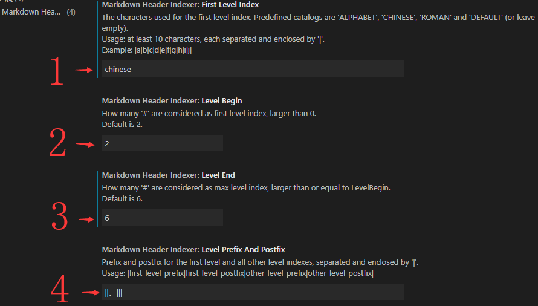

# Markdown Header Indexer

[English version](README.md).

`Markdown Header Indexer`是一款为`Markdown`文件更新标题序号的`VSCode`插件。初始开发于`VSCode 1.41.0`，没有其它依赖。理论上所有此版本后的`VSCode`均可使用。

本文使用`Markdown Header Indexer`的以下配置生成标题序号：

| 配置项 | 取值 | 默认 |
| --------   | ----- | :-----: |
| First Level Index | Chinese | 否 |
| Level Begin | 2 | 是 |
| Level End | 6 | 是 |
| Level Prefix And Postfix | \|\|、\|\|\| | 否 |

## 一、 特点


### 1.1 更新标题序号

没有序号则`添加`，有序号则`更新`。

默认支持`VSCode`中的标题规则：

* `#`为文章标题，不加标题序号。
* `##`为一级标题，可以定义不同的标题名称，如`第一章`、`Chapter One`、`A`、`1`、`IV`等。
* `###`至`######`使用数字，以`.`分隔，如`1.1`，`2.3.4.5.6`等。
* 多于`6个#`不添加序号。

通过修改配置：

* 可以为`#`及多于`6个#`的标题添加序号。
* 为一级标题设置不同的标题名称。
* 为各级标题添加前缀和后缀，如`<< 1.2 >>`，`===[ 1.3 >>>>`等。

配置应用于整个文档，同一文档中不能有多个配置同时生效。

通过`Ctrl+Shift+P`打开命令窗口，输入或选择`Markdown Update Header Index`完成更新标题序号操作。不会对非标题行有任何影响。

### 1.2 清除标题序号

根据配置的当前配置，清除所有标题序号。所以，在修改配置前，应先执行一次`清除标题序号`的操作。

通过`Ctrl+Shift+P`打开命令窗口，输入或选择`Markdown Remove Header Index`完成清除标题序号操作。不会对非标题行有任何影响。

## 二、 插件配置及示例

### 2.1 配置内容

`Markdown Header Indexer`共有如下配置：



| 配置项 |  默认值 |
| --------  | :-----: |
| First Level Index | Default (or empty) |
| Level Begin | 2 |
| Level End | 6 |
| Level Prefix And Postfix | \|\|\|\|\| |

### 2.2 示例文档

本文所有示例基于以下文档：

```markdown
# Header One
## Header Two
### Header Three
#### Header Four
##### Header Five
###### Header Six
####### Header Seven
## Header Two
```

为显示紧凑，忽略了所有空行，后同。

### 2.3 默认功能

使用默认配置`更新标题序号`结果如下：

```Markdown
# Header One
## 1 Header Two
### 1.1 Header Three
#### 1.1.1 Header Four
##### 1.1.1.1 Header Five
###### 1.1.1.1.1 Header Six
####### Header Seven
## 2 Header Two
```

`Header Seven`不在标题级别范围之内，所以没有添加序号。

`清除标题序号`后为恢复为原始文档。

如果手工为`Header Seven`添加了序号，`清除标题序号`不会修改该行。

### 2.4 配置项1：`First Level Index`

以下预定义序号的名称，如`ALPHABET`、`ROMAN`等大小写不敏感。

将`配置项1`修改为`ALPHABET`后，`更新标题序号`结果如下：

```markdown
# Header One
## A Header Two
### 1.1 Header Three
#### 1.1.1 Header Four
##### 1.1.1.1 Header Five
###### 1.1.1.1.1 Header Six
####### Header Seven
## B Header Two
```

将`配置项1`修改为`ROMAN`后，`更新标题序号`结果如下：

```markdown
# Header One
## I Header Two
### 1.1 Header Three
#### 1.1.1 Header Four
##### 1.1.1.1 Header Five
###### 1.1.1.1.1 Header Six
####### Header Seven
## II Header Two
```

将`配置项1`设置为`chinese`，`配置项4`设置为`||、|||`，`更新标题序号`结果如下：

```markdown
# Header One
## 一、 Header Two
### 1.1 Header Three
#### 1.1.1 Header Four
##### 1.1.1.1 Header Five
###### 1.1.1.1.1 Header Six
####### Header Seven
## 二、 Header Two
```

注意`Header Two`序号后面的`、`，这是序号后缀，将在`配置项4`中设置。序号与标题内容之间自动插入一个空格，可手工删除，不影响更新和清除。

`配置项1`设置`DEFAULT`或空字符串时使用数字序号，所以是无限的，其它序号均支持数量有限：

* ALPHABET: 26, `A` to `Z`
* CHINESE: 20, `一` to `二十`
* ROMAN: 20, `I` to `XX`
* ENGLISH: 20, `One` to `Twenty`

若要支持超过限制的序号，可自行设置：用`|`将所有序号分隔。示例如下：

```text
|a|b|c|d|e|f|g|h|i|j|k|l|m|n|o|p|q|r|s|t|u|v|w|x|y|z|AA|BB|CC|DD|
```

该定义只对一级标题有效。自定义的标题序号字符串中**不能包含空格**，且至少提供`10`个值，否则将使用`DEFAULT`。

### 2.5 配置项2：`Level Begin`及配置项3：`Level End`

`配置项2`和`配置项3`定义了`标题级别范围`，只有在该范围的标题才会被更新及清除标题序号。

将`配置项2`设置为`1`，`配置项3`设置为`7`，执行`更新标题序号`后结果如下：

```markdown
# 1、 Header One
## 1.1 Header Two
### 1.1.1 Header Three
#### 1.1.1.1 Header Four
##### 1.1.1.1.1 Header Five
###### 1.1.1.1.1.1 Header Six
####### 1.1.1.1.1.1.1 Header Seven
## 1.2 Header Two
```

* 因为`配置项2`被设置为`1`，所以`Header One`也被添加了序号。
* 因为`配置项3`被设置为`7`，所以`Header Seven`也被添加了序号。

### 2.6 配置项4：`Level Prefix And Postfix`

`配置项4`使用`|`分隔前后缀，按顺序为：

1. 一级标题前缀。
1. 一级标题后缀。
1. 其它标题前缀。
1. 其它标题后缀。

不使用后缀将其设置为空客串即可。

将`配置项4`设置为`|第|章|||`，`配置项1`设置为`CHINESE`，`配置项2`为`2`，`配置项3`为`6`，执行`更新标题序号`后结果如下：

```markdown
# Header One
## 第一章 Header Two
### 1.1 Header Three
#### 1.1.1 Header Four
##### 1.1.1.1 Header Five
###### 1.1.1.1.1 Header Six
####### Header Seven
## 第二章 Header Two
```

将`配置项4`设置为`|Chapter ||||`，`配置项1`设置为前面自定义的支持最多23个序号的内容，执行`更新标题序号`后结果如下：

```markdown
# Header One
## Chapter One Header Two
### 1.1 Header Three
#### 1.1.1 Header Four
##### 1.1.1.1 Header Five
###### 1.1.1.1.1 Header Six
####### Header Seven
## Chapter Two Header Two
```

注意以上设置的一级标题前级`Chapter`后面有一个空格，如果没有这个空格，则结果如下：

```markdown
# Header One
## ChapterOne Header Two
### 1.1 Header Three
#### 1.1.1 Header Four
##### 1.1.1.1 Header Five
###### 1.1.1.1.1 Header Six
####### Header Seven
## ChapterTwo Header Two
```

**在前缀、后缀的实际内容前后，如果存在多个空格，则系统只保留一个空格**。

将`配置项4`设置为`|||<<|>>|`，`配置项1`设置为`DEFAULT`，执行`更新标题序号`后结果如下：

```markdown
# Header One
## 1 Header Two
### <<1.1>> Header Three
#### <<1.1.1>> Header Four
##### <<1.1.1.1>> Header Five
###### <<1.1.1.1.1>> Header Six
####### Header Seven
## 2 Header Two
```

## 三、 注意事项

### 3.1 修改配置文件

`更新标题序号`的过程是先执行`清除标题序号`，再根据配置添加标题序号。

如果在两次更新过程之间，或者更新与清除操作之间变更过配置，标题序号可能清除不完整。因此：

> 在修改配置之前，应执行`清除标题序号`。

### 3.2 标题内容

标题内容`不要以数字开始`，否则可能被错误清除。

## 四、 Markdown参考

* [Visual Studio Code's Markdown Support](http://code.visualstudio.com/docs/languages/markdown)
* [Markdown Syntax Reference](https://help.github.com/articles/markdown-basics/)
