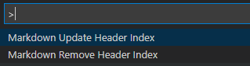
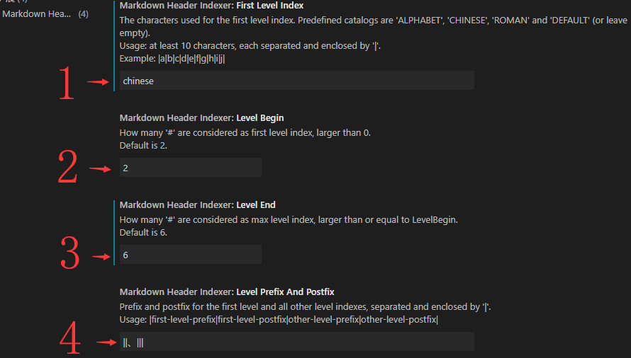

# Markdown Header Indexer

[中文版](README-CN.md)

`Markdown Header Indexer` is a vscode plugin that allows you set the sequence number for the markdown headers.

It was originally developed with VSCode 1.41.0 and has no other dependencies.

This article uses the following configuration of the `Markdown Header Indexer` to generate header sequences:

| Setting | Value | Default |
| --------   | ----- | :-----: |
| First Level Index | English | No |
| Level Begin | 2 | Yes |
| Level End | 6 | Yes |
| Level Prefix And Postfix | \|Chapter \| -\|\|\| | No |

## Chapter One - Features



### 1.1 Update Header Index

If there is no sequence number, add a sequence number to the header, otherwise update the sequence number.

Markdown header rule in VSCode are supported by default:

* `#` is the file title, no sequence number will be added.
* `##` is the first level title and can use different strings such as "Chapter One", "A", "IV" etc.
* `###` to `######` use numbers as sequence numbers, separated by '.'. Example: `1.1`, `2.3.4.5.6` etc.
* Header with more than 6 `#` will not have a sequence number added.

By change configuration, you can:

* Add sequence numbers to headers containing any number of `#`.
* Set a different sequence number string for the first level headers.
* Add prefix and postfix string to the sequence number.

The configuration applies to all document.

To run the function, open command window with `Ctrl+Shift+P`, and select `Markdown Update Header Index`.

### 1.2 Remove Header Index

Clear all sequence numbers according to the current configuration. **Remember to remove all header indexes via this function before changing the configuration**.

To run the function, open command window with `Ctrl+Shift+P`, and select `Markdown Remove Header Index`.

## Chapter Two - Extension Settings

### 2.1 Configuration context

`Markdown Header Indexer` has the following settings:



| Setting |  Default |
| --------  | :-----: |
| First Level Index | Default (or empty) |
| Level Begin | 2 |
| Level End | 6 |
| Level Prefix And Postfix | \|\|\|\|\| |

### 2.2 Example file

All examples are based on this markdown file, empty lines are omitted:

```markdown
# Header One
## Header Two
### Header Three
#### Header Four
##### Header Five
###### Header Six
####### Header Seven
## Header Two
```

### 2.3 Default effect

Update header index with default settings:

```Markdown
# Header One
## 1 Header Two
### 1.1 Header Three
#### 1.1.1 Header Four
##### 1.1.1.1 Header Five
###### 1.1.1.1.1 Header Six
####### Header Seven
## 2 Header Two
```

`Header Seven` is outside the sequence header level, so no serial number was added.

Running `Markdown Remove Header Index` will revert the file to the original document。

If you set it manually, the sequence number of the `Header Seven` will not be deleted.

### 2.4 Setting 1：`First Level Index`

The predefined first level index pattern names are case insensitive.

Setting 1 set to `ALPHABET`:

```markdown
# Header One
## A Header Two
### 1.1 Header Three
#### 1.1.1 Header Four
##### 1.1.1.1 Header Five
###### 1.1.1.1.1 Header Six
####### Header Seven
## B Header Two
```

Setting 1 set to `ROMAN`:

```markdown
# Header One
## I Header Two
### 1.1 Header Three
#### 1.1.1 Header Four
##### 1.1.1.1 Header Five
###### 1.1.1.1.1 Header Six
####### Header Seven
## II Header Two
```

If you set `Setting 1` to an empty string or `default`, it will use numbers as the sequence number. At this point, the serial number is infinite. But other predefined patterns have numerical ranges:

* ALPHABET: 26, `A` to `Z`
* CHINESE: 20, `一` to `二十`
* ROMAN: 20, `I` to `XX`
* ENGLISH: 20, `One` to `Twenty`

If the sequence is out of range, the number will be used. For example, there is no letter in the `ALPHABET` that corresponds to 27, so just use the number 27 as the sequence number:

```markdown
# Header One
## A Header Two
...
## Z Header Two
## 27 Header Two
```

To support sequence numbers that exceed the limit, you must set your own. Set `Setting 1` as follows, for example:

```text
|a|b|c|d|e|f|g|h|i|j|k|l|m|n|o|p|q|r|s|t|u|v|w|x|y|z|AA|BB|CC|DD|
```

Now we have a sequence containing 30 numbers.

As described in the configuration name, `Setting 1` only works for the first level index. Customized first level index should contain no blank space and at least 10 sequence number should be provided. Otherwise, `DEFAULT` will be applied.

### 2.5 Setting 2：`Level Begin` and Setting 3：`Level End`

`Setting 2` and `Setting 3` defines the header range for applying the sequence number.

Set `Setting 2` to `1` and `Setting 3` to `7` and you'll get following result:

```markdown
# 1 Header One
## 1.1 Header Two
### 1.1.1 Header Three
#### 1.1.1.1 Header Four
##### 1.1.1.1.1 Header Five
###### 1.1.1.1.1.1 Header Six
####### 1.1.1.1.1.1.1 Header Seven
## 1.2 Header Two
```

* Since `Setting 2` is set to `1`, the `Header One` is added a sequence number.
* Since `Setting 3` is set to `7`, the `Header Seven` is added a sequence number.

### 2.6 Setting 4：`Level Prefix And Postfix`

`Setting 4` uses `|` to separate prefixes and suffixes:

1. Prefix for the first level index.
1. Suffix for the first level index.
1. Prefix for other level indexes.
1. Suffix for other level indexes.

You can leave it empty if you don't use a specified prefix or suffix.

Set `Setting 4` to `|Chapter ||||` and `Setting 1` to `ENGLISH`, then you'll get:

```markdown
# Header One
## Chapter One Header Two
### 1.1 Header Three
#### 1.1.1 Header Four
##### 1.1.1.1 Header Five
###### 1.1.1.1.1 Header Six
####### Header Seven
## Chapter Two Header Two
```

Note that there is a space after the `Chapter`. If there is no such space, the result will be as follows:

```markdown
# Header One
## ChapterOne Header Two
### 1.1 Header Three
#### 1.1.1 Header Four
##### 1.1.1.1 Header Five
###### 1.1.1.1.1 Header Six
####### Header Seven
## ChapterTwo Header Two
```

**If there are more than one space before and after the actual content of the prefix and suffix, only one space will be kept by the system.**。

Set `Setting 4` to `|||<<|>>|`, `Setting 1` to `DEFAULT` (or leave it empty):

```markdown
# Header One
## 1 Header Two
### <<1.1>> Header Three
#### <<1.1.1>> Header Four
##### <<1.1.1.1>> Header Five
###### <<1.1.1.1.1>> Header Six
####### Header Seven
## 2 Header Two
```

Set `Setting 4` to `|===|---|<<|>>|`, `Setting 1` to `DEFAULT` (or leave it empty):

```markdown
# Header One
## ===1--- Header Two
### <<1.1>> Header Three
#### <<1.1.1>> Header Four
##### <<1.1.1.1>> Header Five
###### <<1.1.1.1.1>> Header Six
####### Header Seven
## ===2--- Header Two
```

## Chapter Three - Attention

### 3.1 Change Configuration

`Markdown Update Header Index` will perform `Markdown Remove Header Index` first, then add sequence numbers for headers. `Markdown Remove Header Index` runs according to current configuration. Header sequence numbers may be cleared incompletely if configuration changes are made between update processes, or between update and remove operations.

So:

> Before changed configuration, run `Markdown Remove Header Index` first.

### 3.2 Header Content

The content of the header `Do not begin with a`, as it may be cleared by mistake.

## Chapter Four - Markdown References

* [Visual Studio Code's Markdown Support](http://code.visualstudio.com/docs/languages/markdown)
* [Markdown Syntax Reference](https://help.github.com/articles/markdown-basics/)

**Enjoy!**
